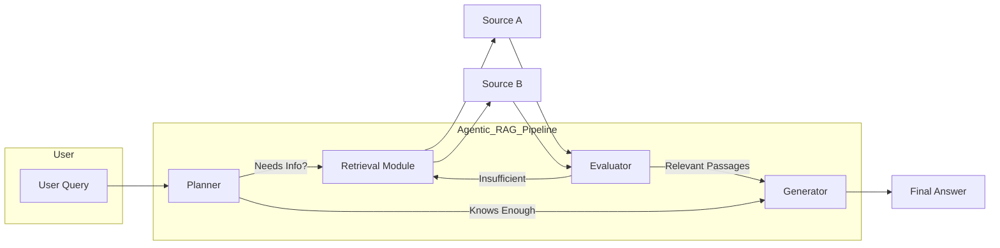

# Agentic RAG Toolkit

A comprehensive guide to understanding **Agentic Retrieval‑Augmented Generation (RAG)**—a methodology that combines planning, retrieval, evaluation, and generation into an autonomous AI workflow.

## 🌐 What Is Agentic RAG?

Agentic RAG leverages the power of large language models (LLMs) alongside external knowledge sources to deliver accurate, up‑to‑date, and contextually relevant answers. Unlike traditional generation methods that solely rely on pretrained knowledge, Agentic RAG operates as an intelligent agent that:

1. **Analyzes the Question** to identify gaps in internal knowledge.
2. **Plans Retrieval** steps, choosing which databases or APIs to consult.
3. **Fetches Information** from one or multiple sources.
4. **Evaluates Relevance** of retrieved data against the original query.
5. **Refines or Re‑queries** if necessary to fill any remaining gaps.
6. **Generates the Final Response**, integrating both external evidence and intrinsic model understanding.

This cyclical process ensures higher factual accuracy, transparency through citations, and adaptability to evolving data.

## 🏛️ Key Components

* **Planner**: Examines the user’s input and determines whether to fetch new data or proceed directly to generation.
* **Retrieval Module**: Interfaces with knowledge stores—such as vector embeddings, document indexes, or web APIs—to collect candidate passages.
* **Evaluator**: Applies relevance scoring (e.g., similarity metrics or heuristics) to filter and rank retrieved passages.
* **Generator**: Synthesizes the answer, weaving in citations or references to the most pertinent external content.

## 🏗️ Architecture Overview

1. **User Query**: Any natural language question.
2. **Planner Decision**:

   * If the model’s internal knowledge suffices, skip retrieval.
   * Otherwise, initiate the retrieval loop.
3. **Retrieval Module**: Connects to configured sources and fetches context snippets.
4. **Evaluator**: Scores and filters passages; can loop back to retrieval if quality is low.
5. **Generator**: Produces the final response, embedding references to the sources that informed the answer.

## 🎯 Benefits of Agentic RAG

* **Accuracy**: Reduces hallucinations by grounding responses in real data.
* **Currency**: Incorporates the latest information beyond model training cutoff.
* **Transparency**: Clearly cites external sources, enabling auditability.
* **Flexibility**: Supports multiple retrieval strategies and dynamic decision‑making.

## 🔧 Deployment Considerations

* **Source Configuration**: Define each knowledge store in a structured descriptor (e.g., JSON or YAML). Include connection details, embedder parameters, and query settings.
* **Model Selection**: Choose an LLM provider based on cost, latency, and performance requirements.
* **Scalability**: Architect retrieval components to handle high query volumes—consider caching, parallel retrieval, and rate‑limiting.
* **Monitoring**: Track retrieval success rates, evaluation scores, and generation quality to identify bottlenecks.

